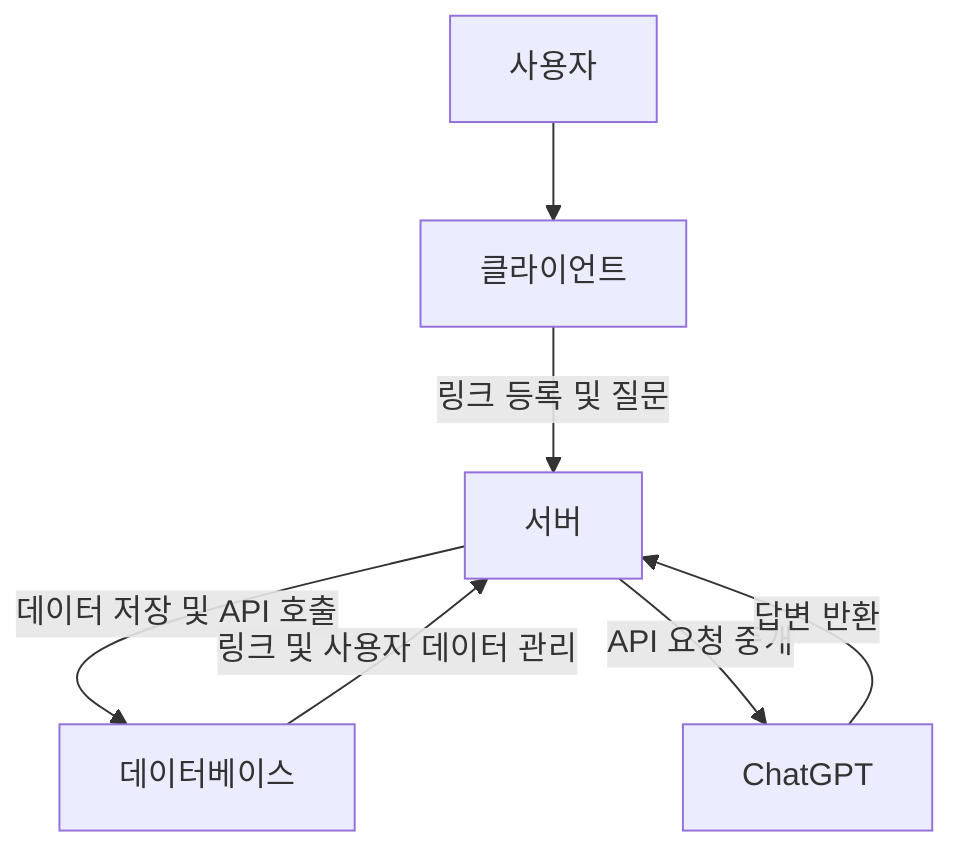

# 📌 링크 모음 어플 + ChatGPT API 통합

**링크 모음 어플**은 자주 사용하는 앱을 설치하지 않고도 빠르게 접근 가능한 **웹 기반 링크 관리**를 제공합니다. 이를 통해 **스마트폰 저장 공간을 절약**하고 **성능 최적화**를 실현합니다. 더불어 **ChatGPT API**와 통합하여 사용자 질문에 실시간으로 응답하는 기능을 지원, AI 서비스의 부담을 최소화합니다.

---

## 🚀 프로젝트 개요
### 🔹 유사 프로젝트 사례 및 문제점
스마트폰의 앱 설치 부담과 자원 소모 문제를 해결하고자 웹 기반 링크 접근 방식을 제안합니다. 기존 북마크 관리 앱(**Pocket** 등)은 링크 관리에 중점을 두지만, 실시간 AI 통합 서비스는 제공하지 않습니다.

### 🔹 프로젝트 특징
1. **저장 공간 절약**: 웹 기반으로 접근하여 스마트폰의 저장 용량을 절감합니다.
2. **성능 향상**: 앱 설치 부담 없이 필요한 기능만 제공합니다.
3. **ChatGPT API 통합**: 간단한 질문과 응답을 경량화된 방식으로 처리합니다.

---

## 🛠️ 기술 스택
- **Frontend**: React, React Native
- **Backend**: Node.js, Express
- **Database**: MongoDB 또는 Firebase
- **AI Integration**: ChatGPT API

## 📊 시스템 아키텍처

아래 아키텍처는 클라이언트-서버 구조로, 사용자 요청을 비동기로 처리하여 최적화된 성능을 제공합니다.

---

## 🌟 기대 효과
- **저장 공간 절약**: 앱 설치 부담을 줄이고 브라우저 기반으로 웹사이트 접근.
- **성능 최적화**: 필요 최소한의 자원만 사용하여 성능 보장.
- **사용자 경험 개선**: ChatGPT API의 경량화된 AI 서비스로 효율적인 사용자 경험 제공.

## 📈 성능 지표 및 도구
1. **메모리 사용량**: 앱 실행 시 메모리 사용 측정.
2. **CPU 사용량**: AI 호출 시 자원 소비량 확인.
3. **응답 시간**: 사용자 입력에 대한 응답 속도.
4. **배터리 소모량**: 앱 실행 시 배터리 사용량.

### 성능 측정 도구
- **Android Profiler (Android Studio)**
- **Instruments (Xcode)**
- **Firebase Performance Monitoring**

---

## 💡 추가 참고 자료
- [OpenAI Dedicated Instance](https://openai.com/index/introducing-chatgpt-and-whisper-apis/)
- [BrowserStack Memory Usage Guide](https://www.browserstack.com/docs/app-performance/app-performance-guides/android/memory-usage)

---
